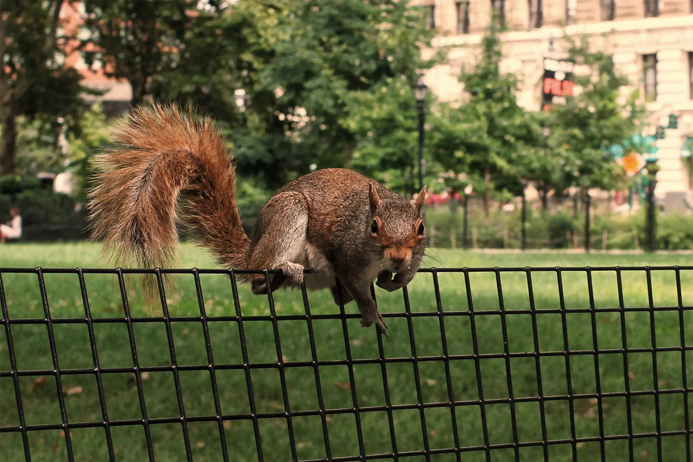

```{r load-packages, include = FALSE}
# Add any additional packages you need to this chunk
library(tidyverse)
library(tidymodels)
library(palmerpenguins)
library(knitr)
library(xaringanthemer)
library(RColorBrewer)
library(paletteer)
library("leaflet")
library(stringr)
library(ggplot2)
library(hrbrthemes)
library(ggspatial)
library(gifski)
library(lubridate)
library(gganimate)
```

```{r, "setup", include=FALSE}
# For better figure resolution
knitr::opts_chunk$set(fig.retina = 3, dpi = 300, fig.asp = 0.618, out.width = "75%", warning = FALSE, message = FALSE, echo = FALSE)
```

```{r, "load-data", include=FALSE}
# Load your data here
nyc_squirrels <- readr::read_csv("https://raw.githubusercontent.com/rfordatascience/tidytuesday/master/data/2019/2019-10-29/nyc_squirrels.csv")
```

```{r}
style_xaringan(
  title_slide_background_image = "img/BagelSquirrel.jpg"
)
```

## Why squirrels? 

<html>
<body>
<iframe width="500" height="315" src="https://www.youtube.com/embed/SSUXXzN26zg" title="YouTube video player" frameborder="0" allow="accelerometer; autoplay; clipboard-write; encrypted-media; gyroscope; picture-in-picture" allowfullscreen></iframe>

<iframe width="500" height="315" src="https://www.youtube.com/embed/29VG7D9eGm4?start=472" title="YouTube video player" frameborder="0" allow="accelerometer; autoplay; clipboard-write; encrypted-media; gyroscope; picture-in-picture" allowfullscreen></iframe>
</body>
</html>

---
class: center, middle


## How do squirrels behave in Central Park? 

Our study attempts to answer a multitude of questions related to the connections between squirrel behaviors and other factors. 
Are squirrel demographic uniform across the entirety of the park? Is there a correlation between the squirrel population of a given hectare of the park and the environment in which they inhabit? Or the noises that they make in relation to the day of week?
---

class: inverse, center, middle

# An Introduction to our dataset
##NYC_Squirrels 

This data comes from the New York City Squirrel Census, which is a raw NY data file. The data was collected by a group of volunteers led by Jamie Allen, a humorist and writer, with the hopes of tracking the Eastern gray (Sciurus carolinensis) population in New York. 

When compiling the total census population, Allen and his volunteers employed a divide and conquer method, dividing Central Park into 350 hectares. Then, the volunteers spread out and counted and observed squirrels once in the morning and once at night. They then calculated the total number of squirrels by using a formula developed by Vagn Flyger, a squirrel biologist. 

---

## What are the color demographics of squirrels in Central Park?

```{r, "cleaning-data", echo=FALSE}
nyc_squirrels <- nyc_squirrels %>%
  mutate(day_of_week = case_when(
    date %in% c(10062018, 10072018, 10132018, 10142018, 10202018, 10212018, 10272018, 10282018) ~ "weekend",
    TRUE ~ "weekday"
  ))
```

```{r, "behavior-variable-merge", echo=FALSE}
nyc_squirrels <- nyc_squirrels %>%
  mutate(behavior = case_when(
    running == TRUE ~ "running",
    chasing == TRUE ~ "chasing",
    climbing == TRUE ~ "climbing",
    eating == TRUE ~ "eating",
    foraging == TRUE ~ "eating",
    TRUE ~ "other"
  ))
```

```{r, "noise-variable-merge", echo=FALSE}
nyc_squirrels <- nyc_squirrels %>%
  mutate(noise = case_when(
    kuks == TRUE ~ "kuks",
    quaas == TRUE ~ "quaas",
    moans == TRUE ~ "moans",
    TRUE ~ "no noise"
  ))
```

```{r, "hectare_number_letter", echo=FALSE}
library(stringr)
nyc_squirrels$hectare_number <- str_sub(nyc_squirrels$hectare,1,2) 
nyc_squirrels$hectare_letter <- str_sub(nyc_squirrels$hectare,3,3) 
```

```{r, "date_variable", echo=FALSE}
nyc_squirrels <- nyc_squirrels %>%
  mutate(date = lubridate::mdy(date),
         hectare_number = as.numeric(hectare_number),
         day = day(date))
```


```{r,out.width = "60%", "pie-chart-fur-color", warning=FALSE, echo=FALSE, fig.alt = "This visualization is a simple pie chart which shows the distribution of squirrel colors within Central Park. This pie chart contains all obbserved squirrels. It shows that about 80% of the squrrels are considered gray, about 10% are considered cinnamon, about 7% are considered N.A or did not have a recorded color, and the last 3% are considered to be black"}
ggplot(data = nyc_squirrels, aes(x = "", y = primary_fur_color, fill = primary_fur_color)) +
  geom_col() + 
  labs(title = "Distribution of Primary Fur Color Among Squirrels in NYC", x = "", y = "") +
  coord_polar(theta = "y") + 
  scale_fill_brewer() + 
   scale_fill_manual(values = c("Black", "bisque3", "dimgray"), na.value = "lightskyblue1") +
  theme_void()
```

---

## What is the age distribution of squirrels in Central Park? 

```{r, keep.source = FALSE, warning=FALSE, echo=FALSE, fig.alt= "Age Distribution of Squirrels. This visualization is a single stacked bar that breaks down the percentages of squirrels, in the whole data set, by age. The three catagories are juvenile, adult, and na. This visualization shows that in Central park 84.95% of all squirrels can be catagroized as adults, 10.92% of all squirrels can be catagorized as juveniles, and the remaining 4.13% are listed as NA (their age could not be determined)"}
squirrel_ages <- nyc_squirrels %>%
  mutate(age = na_if(age,'?'), n=1) %>%
  group_by(age) %>%
  summarize(age_sum = sum(n)) %>%
  ungroup() %>%
  mutate(total = sum(age_sum), dummy = '') %>%
  summarize(age, age_sum, total, dummy, pct_age = (age_sum/total)*100)

squirrel_ages[is.na(squirrel_ages)] <- "Unknown"

ggplot(squirrel_ages, aes(x=dummy, y= pct_age, fill=age)) +
  geom_col() +
  geom_text(aes(label=paste0(round(pct_age,digits=2), "%")), 
            position = position_stack(vjust = 0.5)) +
  scale_fill_brewer(palette = "Paired") +
    theme_minimal(base_size = 16) +
    labs(x = "Total Population", 
         y ="Percentage", 
         fill='Age Group') +
   ggtitle('Central Park Squirrel Population by Age Group') +
    theme(plot.title = element_text(hjust = 0.5)) 
```

---
## What is the proportional distribution of fur colors based on age group in Central Park squirrels?

```{r, fig.alt= "Color of Squirrels Based on Age. This data visualization is a stacked bar chart that shows the  distribution of squirrel fur color to age (juvenile or adult). For both adults and juveniles, gray squirrels are the highest percentage of their population - making up about 80% and 76% of the population respectivley. The next highest color is cinnamon squirrels, they make up about 10% of the adult population and 15% of the juvenile population. For both adults and juveniles na vlaues and black squirrels both make up10% collectivley - they stand at aproximatley 5% for each"}
nyc_squirrels %>%
  filter(age !='?') %>%
  mutate(n=1)%>%
  group_by(age) %>%
  ggplot() +
    geom_col(aes(y=n,x=age, fill=primary_fur_color), position="fill") +
    ggtitle('Demographics of Central Park Squirrels') +
    theme(plot.title = element_text(hjust = 0.5)) +
    labs( x='Age Group', y= 'Proportion') +
    labs(fill='Primary Fur Color') +
    scale_fill_manual(values = c("black", "bisque3", "dimgray"), na.value = "lightskyblue1")
```

---

## How does squirrel behavior vary based on time of week?

```{r, "behavior-density-faceted-by-weekend", fig.alt = "This data visualization is a bar chart which shows the count of squirrels observed completeing a behavior. This visualizaiton is faceted by weekday and weekend, with one bar chart for each. The data distribution between the weekdays and weekends are identical in the order of frequency of each behavior. For both weedays and weekends behavior in order of popularity consisted of eating, running, climbing, chasing, and other respectivley. For weekdays the observed squirrel count eating was around 675 squirrels, the next highest value, running, was observed in around 375 squirrels. These numbers are consistent with minimal varriation on the weekends"}
ggplot(nyc_squirrels, aes(x = behavior, color = behavior, fill = behavior)) +
  geom_histogram(stat = "count") +
  facet_wrap(~day_of_week) +
  scale_fill_viridis_d()
```

---

## Does behavior stay constant across all fur colors?  

```{r, "stacked_bar", fig.alt = "This data visulaization is a stacked bar chart which shows the distribution of squirrels by color as they complete behaviors. For each behavior (chasing, climbing, eating, other, and running) the total count of squirrels completing the behavior is recorded. Then, each category of behavior is broken down into actions completed by differenct colored squirrels. On order of frequencies the behavior displayed by squirrels are as follows: eating, running, climbing, chasing, and other respectivley. Eating was a behavior displayed by about 1400 squirrels. For each bar/behavior, the highest present count of squirrels is grey, as that is the most common color for squirrels to be in central park.Followiung that in each bar is cinnamon, then black, and then NA values" }
ggplot(nyc_squirrels, aes(fill = primary_fur_color, x = behavior)) + 
    geom_bar(position = "stack", stat = "count") +
    scale_fill_manual(values = c("Black", "bisque3", "dimgray"), na.value = "lightskyblue1")
  
```

---

## Does the day of the week impact noises made?

```{r, "noise-faceted-by-weekend-remove-no-noise", fig.alt= "This data visualization is a bar chart that shows the counto fsquirrels observed making a noise, known as kuks, quaas, and moans. This is then faceted into two different charts that show the difference between the weekdays and weekends. This shows that the most observes sound that is made by New York Central Park squirrels are kuks; however it is important to note that the conservation count for weekdays and weekends are 59 squirrels and 42 squirrels respectivley. The next highest value is a quaa which was observed 11 times on weekdays and 22 times on weekdays. Moans were only heard on the weekend, this was only observed once though"}

nyc_squirrels_noise <- nyc_squirrels %>%
  mutate(noise = as.factor(noise)) %>%
  filter(noise != "no noise") %>%
  mutate(noise = fct_drop(noise))
  
  ggplot(nyc_squirrels_noise, aes(x = noise, color = noise, fill = noise)) +
  geom_histogram(stat = "count") +
  facet_wrap(~day_of_week) +
  scale_fill_viridis_d()
```


---

## Where are different color squirrels in Central Park?

```{r, "leaflet-map-color", out.width = "70%", out.height = "80%", fig.alt = "This is a leaflet  plot that shows the squirrels location, and their recorded fur color, based on their latitude and longitude when recorded. This visualization creates a graphic ontop of a map of central park, which the viewer can zoom in and out of to explore the individual data points up close. The distribution of colors is completely random across the park, but this visualization makes clear that gray squirrels are much more common than all other squirrels" }
pal_coats <- colorFactor(c("Black", "bisque3", "dimgray", "lightskyblue1"), domain = c("Black", "Cinnamon", "Grey", "NA"))

#Locations based on fur color
nyc_squirrels %>%
  filter(!is.na(primary_fur_color)) %>%
  leaflet() %>%
  addTiles() %>%
  addCircleMarkers(lng = ~long,
                   lat = ~lat, radius = 3, color = ~pal_coats(primary_fur_color), stroke = FALSE, fillOpacity = 0.9) %>%
  addLegend(position ="topright",pal = pal_coats, values = ~primary_fur_color)
```

---
## Where are different behaviors occuring in Central Park?

```{r, "leaflet_behavior", out.width = "70%", out.height = "80%", fig.alt = "This is a leaflet  plot that shows the squirrels location, and their recorded bahavior, based on their latitude and longitude when recorded. This visualization creates a graphic ontop of a map of central park, which the viewer can zoom in and out of to explore the individual data points up close. This display of behavior shows no patterns based on location within the park but rather a random display of behaviors (chasing, climbing, eating, running, and other) across the entirety of the park"}

pal_behavior <- colorFactor(c("#440154FF", "#404788FF", "#287D8EFF", "#55C667FF", "#FDE725FF"), domain = c("chasing", "climbing", "eating", "running", "other"))

#Locations based on behavior
nyc_squirrels %>%
  filter(!is.na(behavior)) %>%
  leaflet() %>%
  addTiles() %>%
  addCircleMarkers(lng = ~long,
                   lat = ~lat, radius = 3, color = ~pal_behavior(behavior), stroke = FALSE, fillOpacity = 0.9) %>%
  addLegend(position ="topright",pal = pal_behavior, values = ~behavior) 
```

---
## Where do different squirrel behaviors occur over time?

```{r, "leaflet animation", fig.alt = "This visualization is an animated leaflet plot that shows squirrel behaviors over time. The figure maps the behavior observations based on their location, and tracking for time. This display of behavior shows no patterns based on location within the park but rather a random display of behaviors (chasing, climbing, eating, running, and other) across the entirety of the park"}

pal_behavior <- colorFactor(c("#440154FF", "#404788FF", "#287D8EFF", "#55C667FF", "#FDE725FF"), domain = c("chasing", "climbing", "eating", "running", "other"))

# map1 <- ggplot(nyc_squirrels, aes(x = long, y = lat, color = behavior)) +
#  annotation_map_tile(type = "thunderforestoutdoors", zoomin = 0) +
#  geom_spatial_point() +
#  scale_color_viridis_d()
# 
# map_anim <- map1 +
#  transition_time(day)  +
#  labs(title = "Day: {frame_time}")
# 
# animate(map_anim, renderer = gifski_renderer())
# 
# anim_save("map_anim.gif", anim = last_animation())
```

<p align="center">
  <iframe src="https://dcs-210.github.io/w2022-project-mia-luke-sadie/presentation/map_anim.gif" width="400" height="515" frameBorder="0"></iframe>
</p>

---

## Where are squirrels sighted in Central Park?

```{r, "heat-map", out.width = "100%", fig.alt= "This data visualization is a heat map that shows the overall density of squirrel location based on the entire data set. Based on loaction, the squirrels are binned into hectares, each time a squirrel is seen in a hectare - the density of the hectare increased by one. The visualization is clear that there are limited patterns to squirrels observed locations, they are failry evently distributed across the entire park. Hectare E14 is the most densley populated squirrel location over the entire time of data series collection, the density displayed in this hectare is around 20 squirrels. The average hectare had less than 5 squirrels spotted in it over the course of data collection. This revels no patterns to where squirrels are seen, but can be indicative of spots with high forestation, high quantities of food, or limited human activity"}

nyc_squirrels <- nyc_squirrels %>%
  mutate(hectare_number = as.numeric(hectare_number)) 

ggplot(nyc_squirrels, aes(hectare_letter, hectare_number, fill= hectare_squirrel_number)) + 
  geom_tile() + 
  scale_fill_viridis_c(option = "plasma", direction = -1) +
  theme(plot.margin = unit(c(0, 42, 0, 42), "mm"))
```

---

## Where are squirrels sighted over time? 

```{r heatmap_timeseries, fig.alt = "This data visualization is an animated heatmap that shows the changing density of squirrels over the course of the observation period. Similar to the previous heatmap, the squirrels are binned into hectares based on location, each time a squirrel is seen in a hectare - the density of the hectare increased by one. The visualization is clear that there are limited patterns to squirrels observed locations, they are failry evently distributed across the entire park. Hectare E14 is the most densley populated squirrel location over the entire time of data series collection, the density displayed in this hectare is around 20 squirrels. The average hectare had less than 5 squirrels spotted in it over the course of data collection. This revels no patterns to where squirrels are seen, but can be indicative of spots with high forestation, high quantities of food, or limited human activity"}
# 
# nyc_squirrels_sum <- nyc_squirrels %>%
#   group_by(day, hectare_letter, hectare_number) %>%
#   summarise(squirrel_activity = sum(hectare_squirrel_number, na.rm = TRUE))
# 
# p2 <- ggplot(nyc_squirrels_sum, aes(hectare_letter, hectare_number, fill= squirrel_activity)) +
#   geom_tile() +
#   facet_wrap(~day) +
#   scale_fill_viridis_c(option = "plasma", direction = -1) +
#   theme(plot.margin = unit(c(0, 42, 0, 42), "mm"))
# 
# 
# p2
# 
# p1 <- ggplot(nyc_squirrels_sum, aes(hectare_letter, as.numeric(hectare_number), fill= squirrel_activity)) +
#   geom_tile(height = 1, 
#             width = 1) +
#   scale_fill_viridis_c(option = "plasma", direction = -1) +
#     labs(x = "Hectare Letter",
#          y = "Hectare Number",
#          fill = "Squirrel Activity")
# 
# p3 <- p1 +
#   transition_time(day) +
#   labs(title = "Day: {frame_time}") +
#   shadow_mark()
# 
# animate(p3, renderer = gifski_renderer())
# 
# anim_save("heatmap3.gif")

```

<p align="center">
  <iframe src="https://dcs-210.github.io/w2022-project-mia-luke-sadie/presentation/heatmap3.gif"  width="400" height="515" frameBorder="0"></iframe>
</p>

---
## Limitations to the Dataset


- The squirrel census is citizen reported which leaves room for many count errors and identification issues. 

- This dataset is also centered in Central Park New York which only gives us a sample of data from a single area versus the whole of New York. 

- Limited information on who is collecting the data, other than that they are volunteering to count squirrels, so we have to make assumptions about their effectiveness in data collection (i.e. are these kids? retirees? squirrel fanatics?).

---
## Suggested Next Steps

- Conduct a revised NYC Squirrel census that is more comprehensive (takes into account humans, other areas of New York, and other animals in the area). 

- Find a better way to track the squirrels!! GPS tracking or tags could eliminate double sightings and would make identification  easier for the individual reporting a squirrel. This would also be beneficial for a longitudinal study of squirrel behavior and patterns. 

```{r squirrel1, echo = FALSE, out.height =400, out.width = 500}

```
```

