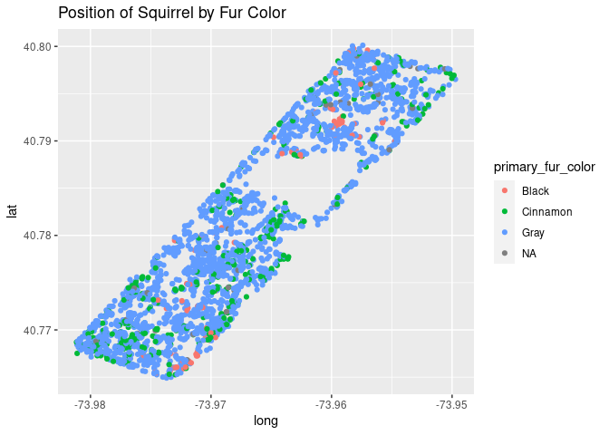
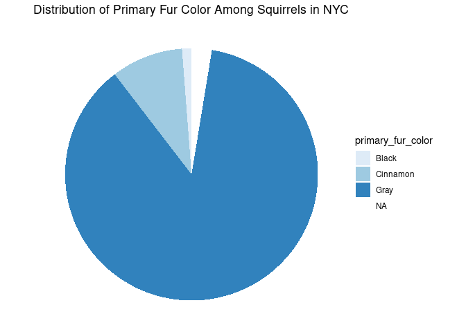

Project proposal
================
Team: Mia Luke Sadie
February 28, 2022

``` r
library(tidyverse)
library(broom)
```

## 1. Introduction

This project takes a look into the New York City squirrel population and
the factors involved in maintaining and changing numbers. We hope to
explore the influences to the NYC squirrel population by borough
comparison and by year. Is there a correlation between the squirrel
population of a given neighborhood and the environment in which they
inhabit? We will take a look into the overall behavior of squirrel
sightings by location in comparison with human populations,
establishments, and parks.

-   Are squirrels seen more frequently at night or during the day
-   What is the most commonly observed squirrel behavior?
-   Does squirrel behavior change depending on time of day or time of
    year?
-   What areas of NYC observe the highest number of squirrels?
-   What is the squirrel to human ratio of NYC? Of different
    neighborhoods?

This data comes from the New York City Squirrel Census, which is a raw
NY data file. The data was collected by a group of volunteers led by
Jamie Allen, a humorist and writer with the hopes of tracking the
Eastern gray (Sciurus carolinensis) population in New York. When
compiling the total census population, they employed a divide and
conquer method, dividing Central Park into 350 hectares. Then, the
volunteers spread out and counted and observed squirrels once in the
morning and once at night. They then calculated the total number of
squirrels by using a formula developed by Vagn Flyger, a squirrel
biologist.

## 2. Data

``` r
nyc_squirrels <- readr::read_csv("https://raw.githubusercontent.com/rfordatascience/tidytuesday/master/data/2019/2019-10-29/nyc_squirrels.csv") 
```

    ## Rows: 3023 Columns: 36

    ## ── Column specification ────────────────────────────────────────────────────────
    ## Delimiter: ","
    ## chr (14): unique_squirrel_id, hectare, shift, age, primary_fur_color, highli...
    ## dbl  (9): long, lat, date, hectare_squirrel_number, zip_codes, community_dis...
    ## lgl (13): running, chasing, climbing, eating, foraging, kuks, quaas, moans, ...

    ## 
    ## ℹ Use `spec()` to retrieve the full column specification for this data.
    ## ℹ Specify the column types or set `show_col_types = FALSE` to quiet this message.

``` r
glimpse(nyc_squirrels)
```

    ## Rows: 3,023
    ## Columns: 36
    ## $ long                                       <dbl> -73.95613, -73.95704, -73.9…
    ## $ lat                                        <dbl> 40.79408, 40.79485, 40.7667…
    ## $ unique_squirrel_id                         <chr> "37F-PM-1014-03", "37E-PM-1…
    ## $ hectare                                    <chr> "37F", "37E", "02E", "05D",…
    ## $ shift                                      <chr> "PM", "PM", "AM", "PM", "AM…
    ## $ date                                       <dbl> 10142018, 10062018, 1010201…
    ## $ hectare_squirrel_number                    <dbl> 3, 3, 3, 5, 1, 2, 2, 3, 9, …
    ## $ age                                        <chr> NA, "Adult", "Adult", "Juve…
    ## $ primary_fur_color                          <chr> NA, "Gray", "Cinnamon", "Gr…
    ## $ highlight_fur_color                        <chr> NA, "Cinnamon", NA, NA, NA,…
    ## $ combination_of_primary_and_highlight_color <chr> "+", "Gray+Cinnamon", "Cinn…
    ## $ color_notes                                <chr> NA, NA, NA, NA, NA, NA, NA,…
    ## $ location                                   <chr> NA, "Ground Plane", "Above …
    ## $ above_ground_sighter_measurement           <chr> NA, "FALSE", "4", "3", NA, …
    ## $ specific_location                          <chr> NA, NA, NA, NA, NA, NA, NA,…
    ## $ running                                    <lgl> FALSE, TRUE, FALSE, FALSE, …
    ## $ chasing                                    <lgl> FALSE, FALSE, FALSE, FALSE,…
    ## $ climbing                                   <lgl> FALSE, FALSE, TRUE, TRUE, F…
    ## $ eating                                     <lgl> FALSE, FALSE, FALSE, FALSE,…
    ## $ foraging                                   <lgl> FALSE, FALSE, FALSE, FALSE,…
    ## $ other_activities                           <chr> NA, NA, NA, NA, "unknown", …
    ## $ kuks                                       <lgl> FALSE, FALSE, FALSE, FALSE,…
    ## $ quaas                                      <lgl> FALSE, FALSE, FALSE, FALSE,…
    ## $ moans                                      <lgl> FALSE, FALSE, FALSE, FALSE,…
    ## $ tail_flags                                 <lgl> FALSE, FALSE, FALSE, FALSE,…
    ## $ tail_twitches                              <lgl> FALSE, FALSE, FALSE, FALSE,…
    ## $ approaches                                 <lgl> FALSE, FALSE, FALSE, FALSE,…
    ## $ indifferent                                <lgl> FALSE, FALSE, TRUE, FALSE, …
    ## $ runs_from                                  <lgl> FALSE, TRUE, FALSE, TRUE, F…
    ## $ other_interactions                         <chr> NA, "me", NA, NA, NA, NA, N…
    ## $ lat_long                                   <chr> "POINT (-73.9561344937861 4…
    ## $ zip_codes                                  <dbl> NA, NA, NA, NA, NA, NA, NA,…
    ## $ community_districts                        <dbl> 19, 19, 19, 19, 19, 19, 19,…
    ## $ borough_boundaries                         <dbl> 4, 4, 4, 4, 4, 4, 4, 4, 4, …
    ## $ city_council_districts                     <dbl> 19, 19, 19, 19, 19, 19, 19,…
    ## $ police_precincts                           <dbl> 13, 13, 13, 13, 13, 13, 13,…

Our dataset has 36 unique variables and 3,023 observations of squirrels.

## 3. Data analysis plan

We seek to answer the following questions in our data analysis: \* Are
squirrels seen more frequently at night or during the day \* What is the
most commonly observed squirrel behavior? \* Does squirrel behavior
change depending on time of day or time of year? \* What areas of NYC
observe the highest number of squirrels? \* What is the squirrel to
human ratio of NYC? Of different neighborhoods? \* How does the squirrel
population differ based on environmental factors?

Our outcome variable is the squirrel population, and the predictor
variables will vary depending on which question we are examining.

Through our analysis, we hope to provide summary statistics on squirrel
behavior, as well as draw conclusions about the relationship between
squirrel behaviors and populations, and the way these factors interact
with their environment.

``` r
summary(nyc_squirrels)
```

    ##       long             lat        unique_squirrel_id   hectare         
    ##  Min.   :-73.98   Min.   :40.76   Length:3023        Length:3023       
    ##  1st Qu.:-73.97   1st Qu.:40.77   Class :character   Class :character  
    ##  Median :-73.97   Median :40.78   Mode  :character   Mode  :character  
    ##  Mean   :-73.97   Mean   :40.78                                        
    ##  3rd Qu.:-73.96   3rd Qu.:40.79                                        
    ##  Max.   :-73.95   Max.   :40.80                                        
    ##                                                                        
    ##     shift                date          hectare_squirrel_number
    ##  Length:3023        Min.   :10062018   Min.   : 1.000         
    ##  Class :character   1st Qu.:10082018   1st Qu.: 2.000         
    ##  Mode  :character   Median :10122018   Median : 3.000         
    ##                     Mean   :10119487   Mean   : 4.124         
    ##                     3rd Qu.:10142018   3rd Qu.: 6.000         
    ##                     Max.   :10202018   Max.   :23.000         
    ##                                                               
    ##      age            primary_fur_color  highlight_fur_color
    ##  Length:3023        Length:3023        Length:3023        
    ##  Class :character   Class :character   Class :character   
    ##  Mode  :character   Mode  :character   Mode  :character   
    ##                                                           
    ##                                                           
    ##                                                           
    ##                                                           
    ##  combination_of_primary_and_highlight_color color_notes       
    ##  Length:3023                                Length:3023       
    ##  Class :character                           Class :character  
    ##  Mode  :character                           Mode  :character  
    ##                                                               
    ##                                                               
    ##                                                               
    ##                                                               
    ##    location         above_ground_sighter_measurement specific_location 
    ##  Length:3023        Length:3023                      Length:3023       
    ##  Class :character   Class :character                 Class :character  
    ##  Mode  :character   Mode  :character                 Mode  :character  
    ##                                                                        
    ##                                                                        
    ##                                                                        
    ##                                                                        
    ##   running         chasing         climbing         eating       
    ##  Mode :logical   Mode :logical   Mode :logical   Mode :logical  
    ##  FALSE:2293      FALSE:2744      FALSE:2365      FALSE:2263     
    ##  TRUE :730       TRUE :279       TRUE :658       TRUE :760      
    ##                                                                 
    ##                                                                 
    ##                                                                 
    ##                                                                 
    ##   foraging       other_activities      kuks           quaas        
    ##  Mode :logical   Length:3023        Mode :logical   Mode :logical  
    ##  FALSE:1588      Class :character   FALSE:2921      FALSE:2973     
    ##  TRUE :1435      Mode  :character   TRUE :102       TRUE :50       
    ##                                                                    
    ##                                                                    
    ##                                                                    
    ##                                                                    
    ##    moans         tail_flags      tail_twitches   approaches     
    ##  Mode :logical   Mode :logical   Mode :logical   Mode :logical  
    ##  FALSE:3020      FALSE:2868      FALSE:2589      FALSE:2845     
    ##  TRUE :3         TRUE :155       TRUE :434       TRUE :178      
    ##                                                                 
    ##                                                                 
    ##                                                                 
    ##                                                                 
    ##  indifferent     runs_from       other_interactions   lat_long        
    ##  Mode :logical   Mode :logical   Length:3023        Length:3023       
    ##  FALSE:1569      FALSE:2345      Class :character   Class :character  
    ##  TRUE :1454      TRUE :678       Mode  :character   Mode  :character  
    ##                                                                       
    ##                                                                       
    ##                                                                       
    ##                                                                       
    ##    zip_codes     community_districts borough_boundaries city_council_districts
    ##  Min.   :10090   Min.   :11          Min.   :4          Min.   :19.00         
    ##  1st Qu.:12081   1st Qu.:19          1st Qu.:4          1st Qu.:19.00         
    ##  Median :12420   Median :19          Median :4          Median :19.00         
    ##  Mean   :11828   Mean   :19          Mean   :4          Mean   :19.07         
    ##  3rd Qu.:12423   3rd Qu.:19          3rd Qu.:4          3rd Qu.:19.00         
    ##  Max.   :12423   Max.   :23          Max.   :4          Max.   :51.00         
    ##  NA's   :3014                                                                 
    ##  police_precincts
    ##  Min.   :10      
    ##  1st Qu.:13      
    ##  Median :13      
    ##  Mean   :13      
    ##  3rd Qu.:13      
    ##  Max.   :18      
    ## 

``` r
nyc_squirrels %>%
  ggplot(na.rm = TRUE, aes(x = long, y = lat, color = primary_fur_color)) +
  labs(title = "Position of Squirrel by Fur Color") +
  geom_point()
```

<!-- -->

``` r
ggplot(data = nyc_squirrels, aes(x = "", y = primary_fur_color, fill = primary_fur_color)) +
  geom_col() + 
  labs(title = "Distribution of Primary Fur Color Among Squirrels in NYC", x = "", y = "") +
  coord_polar(theta = "y") + 
  scale_fill_brewer() + 
  theme_void()
```

<!-- -->
